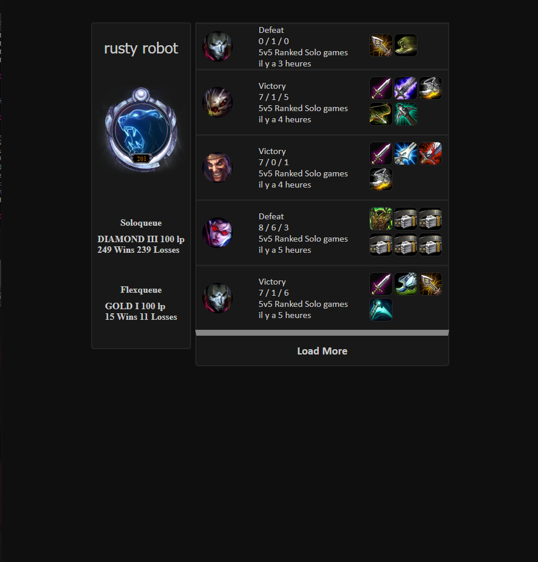
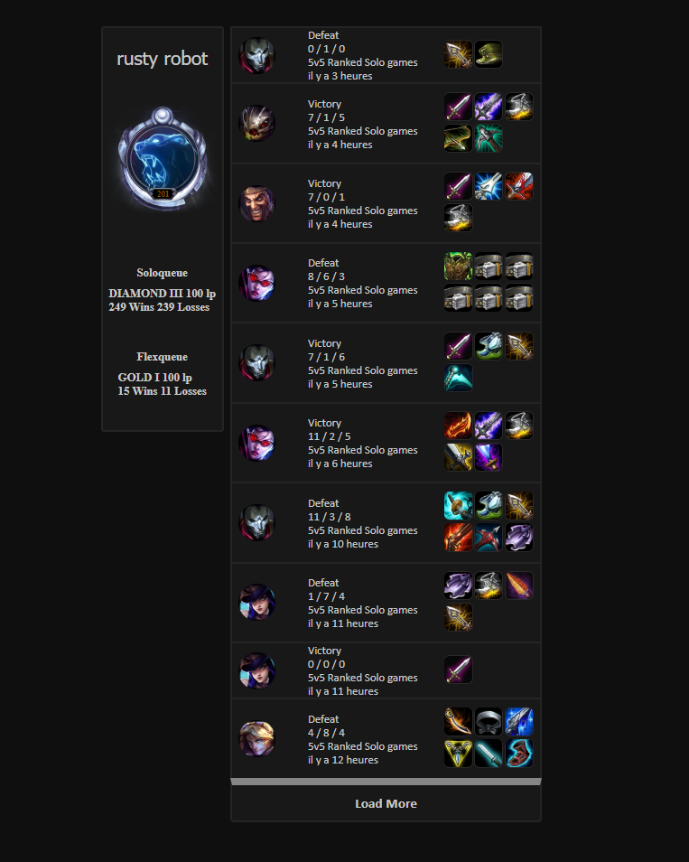
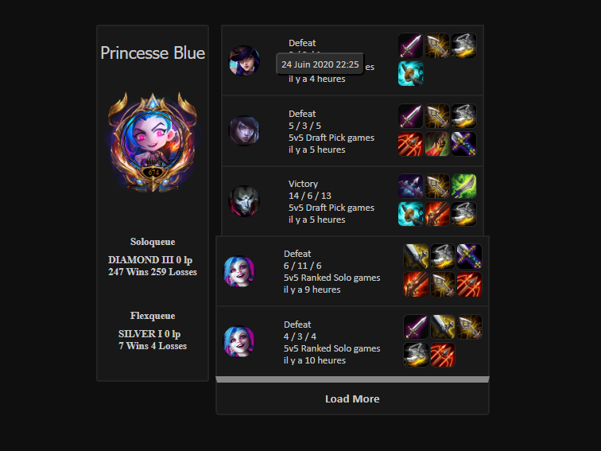

# Sardlul
Voici Sardlul,

Celui ci affiche l'historique d'un utilisateur inscrit dans l'URL, avec divers détails,

projet uniquement réalisé en React / Node

Afin de charger plus de résultat, un bouton est prévu à cet effet

L'heure du début du match ainsi que la date est calculé puis affiché quand on hover "il y a.."
exemple avec un autre profil

