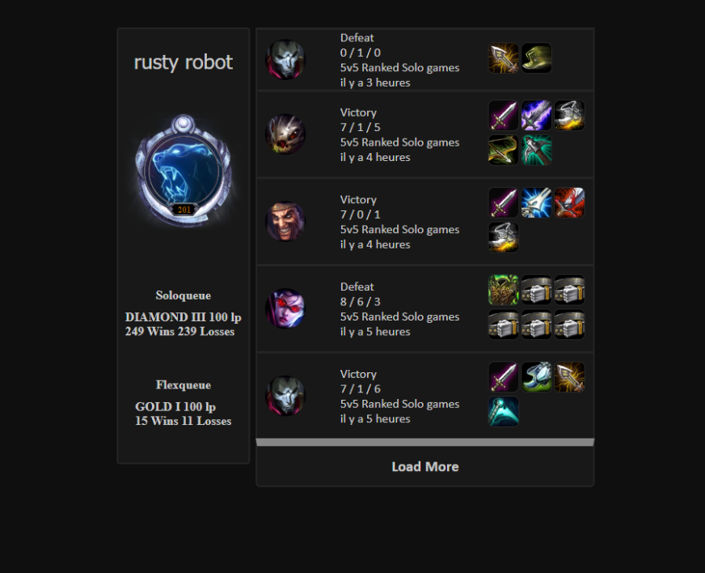

# Sardlul
Voici Sardlul,

Celui ci affiche l'historique d'un utilisateur inscrit dans l'URL, avec divers détails,
informations que je vais chercher via [l'API de riot games](https://developer.riotgames.com/)
toute les images sont trouvée depuis [ddragon](https://riot-api-libraries.readthedocs.io/en/latest/ddragon.html) fourni par riot

projet uniquement réalisé en React / Node

Afin de charger plus de résultat, un bouton est prévu à cet effet

L'heure du début du match ainsi que la date est calculé puis affiché quand on hover "il y a.."
exemple avec un autre profil

